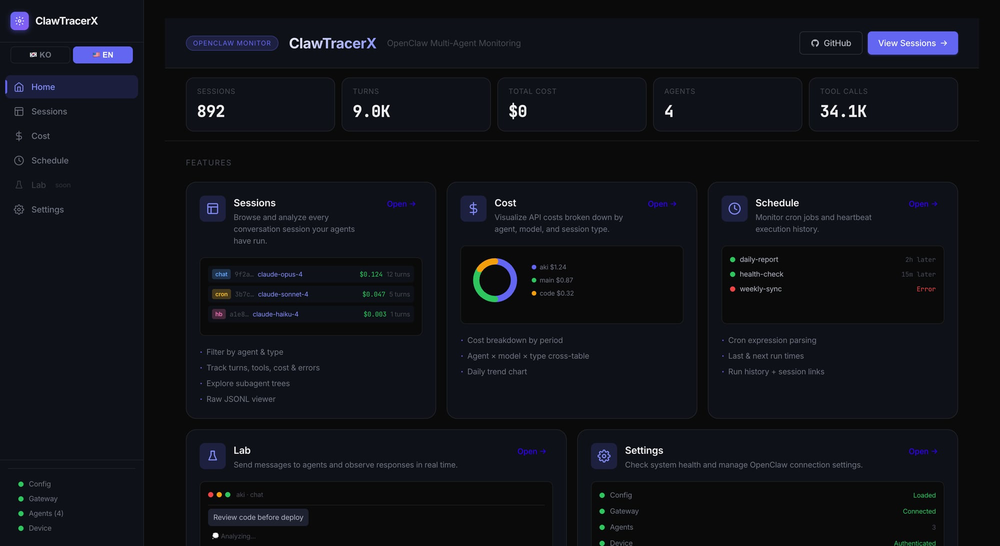
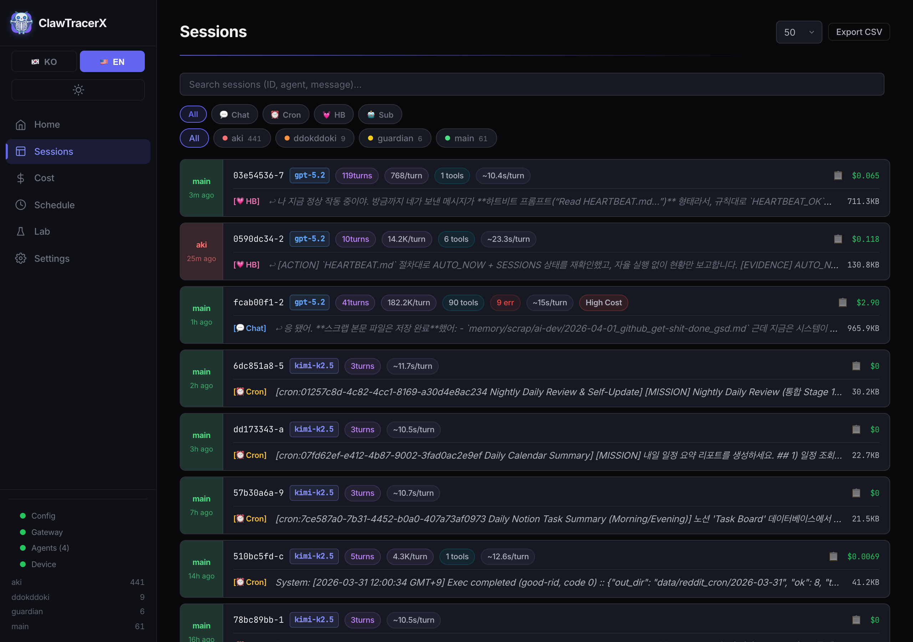
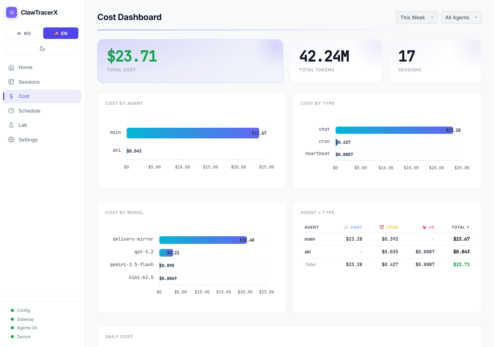

<div align="center">

# ClawTracerX

**See what your AI agents actually do.**

[](https://github.com/kys42/clawtracerx/actions/workflows/ci.yml)
[](https://pypi.org/project/clawtracerx/)
[](https://www.npmjs.com/package/clawtracerx)
[](https://python.org)
[](LICENSE)

Observability tool for [OpenClaw](https://github.com/openclaw/openclaw) agents.<br/>
Parses JSONL session transcripts into a web dashboard + CLI. See every turn, tool call, subagent spawn, and dollar spent — **locally, without sending data anywhere.**

[Installation](#installation) · [Quick Start](#quick-start) · [Web Dashboard](#web-dashboard) · [CLI](#cli) · [Architecture](#architecture)

</div>

---

## Screenshots

| Home | Sessions | Cost Dashboard |
|:---:|:---:|:---:|
|  |  |  |

---

## Features

- **Session Timeline** — Every turn visualized: user messages, assistant thinking, tool calls, subagent spawns, with per-message token counts and cost
- **Subagent Tree** — Recursively parses child sessions to render the full multi-agent execution tree
- **Interactive Graph** — Canvas-based D3 visualization with Tree/Force layout, drag, zoom, and filtering
- **Cost Dashboard** — Per-agent, per-model, per-day breakdown with interactive charts
- **Cron Monitor** — Job run history, heartbeat tracking, success/failure status
- **Lab** — Send messages to agents directly from the dashboard *(beta)*
- **CLI Analysis** — Rich terminal output with ANSI color, Unicode tree rendering, and flexible filtering
- **Read-Only by Design** — Never modifies OpenClaw data; only reads local JSONL files

---

## Installation

### npm (recommended, no Python required)

```bash
npm install -g clawtracerx
```

Automatically downloads the pre-built binary for your platform via `postinstall`.

| Platform | Status |
|----------|--------|
| macOS arm64 (Apple Silicon) | Supported |
| Linux x64 | Supported |
| macOS x64 / Windows | Use pip |

### pip

```bash
pip install "clawtracerx[web]"
```

### From source

```bash
git clone https://github.com/kys42/clawtracerx.git
cd clawtracerx
pip install -e ".[dev]"
```

### Verify

```bash
ctrace --version
ctrace sessions
```

> **Prerequisite** — [OpenClaw](https://github.com/openclaw/openclaw) installed and configured (`~/.openclaw/`).

---

## Quick Start

```bash
# Launch the web dashboard
ctrace web

# Analyze a specific session
ctrace analyze a6604d70

# Check this week's cost
ctrace cost --period week
```

---

## Web Dashboard

```bash
ctrace web                  # http://localhost:8901
ctrace web --port 9000      # custom port
ctrace web --debug          # debug mode with hot reload
```

| Page | Route | Description |
|------|-------|-------------|
| Sessions | `/` | All sessions with agent, type, and date filters |
| Session Detail | `/session/<id>` | Turn-by-turn timeline with tool calls, tokens, cost chart |
| Graph | `/session/<id>/graph` | Interactive execution tree (Tree / Force layout) |
| Cost | `/cost` | Token and cost breakdown by agent, model, day |
| Schedule | `/schedule` | Cron job history and heartbeat status |
| Lab | `/lab` | Send messages to agents in real time |

---

## CLI

```bash
# Sessions
ctrace sessions                          # recent 20
ctrace sessions --agent aki --last 50    # filter by agent
ctrace sessions --type cron              # cron sessions only

# Session analysis
ctrace analyze <session-id>              # UUID prefix match
ctrace analyze aki:92de0796              # agent:id format
ctrace analyze ~/.openclaw/agents/aki/sessions/xxxx.jsonl

# Raw JSONL inspection
ctrace raw <session-id> --turn 0

# Cost
ctrace cost                              # today
ctrace cost --period week
ctrace cost --period month --agent aki

# Cron & Subagents
ctrace crons --last 50 --job <job-id>
ctrace subagents --parent a6604d70
```

<details>
<summary><strong>Example output: <code>ctrace analyze</code></strong></summary>

```
═══════════════════════════════════════════════════════
Session: a6604d70-deb (main)
Started: 2026-02-20 00:00:00 | Model: gemini-3-flash-preview | Provider: google
Type: cron | CWD: ~/.openclaw/workspace
═══════════════════════════════════════════════════════

── Turn 0 ────────────────────────────────────────────
  User (cron)
     "[cron:01257c8d Nightly Daily Review & Self-Update]..."

  Assistant                                4m 28s  $0.305
     Tokens: in=568.3K, out=3.3K, cache=224.9K, total=571.6K

     |-- session_status
     |-- exec(python3 scripts/log_chunker.py)          2.3s
     |-- subagent -> nightly-map-batch-0
     |     task: "batch mapper..."
     |     ok | 14.7s | $0.042 | 12K tokens
     |     |-- read(batch_0_chunks.md)                201ms
     |     |-- exec(gh pr diff 92)                   2340ms
     |     +-- Done (3 turns)
     +-- "DONE: batches=4..."

═══════════════════════════════════════════════════════
Summary
  Turns: 4 | Duration: 4m 28s | Cost: $0.330
  Tokens: in=568K out=3.3K cache=225K total=618K
  Tools: exec*13, write*3, sessions_spawn*3
  Subagents: 3 (success: 2, error: 1)
```

</details>

---

## Data Sources

ClawTracerX reads from `~/.openclaw/` — all sources are **read-only**.

| Source | Path | Contents |
|--------|------|----------|
| Session transcripts | `agents/{id}/sessions/*.jsonl` | Messages, tool calls, tokens, cost, timing |
| Session metadata | `agents/{id}/sessions/sessions.json` | Context injection, system prompt, skills |
| Subagent registry | `subagents/runs.json` | Parent-child mapping, task, duration, outcome |
| Cron run logs | `cron/runs/*.jsonl` | Job ID, status, duration, summary |
| Cron definitions | `cron/jobs.json` | Schedule, agent, model, delivery config |

### What's tracked

| Metric | Status | Notes |
|--------|--------|-------|
| Per-message token & cost | Yes | Usage + cost on every assistant message |
| Per-tool-call timing | Partial | `exec`, `read`, etc. include `durationMs` |
| Subagent internals | Yes | Recursive child JSONL parsing |
| Turn duration | Yes | User timestamp to last assistant timestamp |
| Model changes | Yes | `model_change` events, per-message model field |
| Google/Gemini thinking | Yes | Plain text in `thinking` field |
| OpenAI thinking | No | Fernet-encrypted, not locally decryptable |

---

## Architecture

```
~/.openclaw/agents/{id}/sessions/*.jsonl
                |
    session_parser.parse_session()
                |
        SessionAnalysis
       /                \
   cli.py             web.py
   (ANSI terminal)    (Flask + Jinja2 + REST API)
                         |
                      gateway.py --> OpenClaw Gateway (WebSocket RPC)
```

```
clawtracerx/
  __main__.py          Entrypoint (argparse CLI dispatcher)
  session_parser.py    JSONL -> SessionAnalysis (Turn / ToolCall / SubagentSpawn)
  cli.py               CLI commands -> ANSI terminal output
  web.py               Flask server + REST API + Jinja2 templates
  gateway.py           OpenClaw WebSocket RPC client (Ed25519 auth)
  config.py            Configuration (~/.openclaw/tools/clawtracerx/config.json)
  templates/           Jinja2 HTML (base, sessions, detail, graph, cost, schedule, lab)
  static/
    app.js             Shared utilities (fetchJSON, fmtTokens, escHtml, ...)
    turns.js           Shared turn renderer (detail + lab)
    style.css          Dark Pro design system (CSS custom properties)

npm/                   npm distribution (pre-built binary via postinstall)
tests/                 pytest suite (session parser, CLI, web, gateway)
```

---

## Development

```bash
# Install with dev dependencies
pip install -e ".[dev]"

# Run tests
pytest -v

# Lint
ruff check clawtracerx/ tests/

# Dev server with hot reload
ctrace web --debug --port 8901
```

---

## Contributing

Contributions are welcome! Please open an issue or submit a pull request.

See the [CI pipeline](.github/workflows/ci.yml) for the test matrix (Python 3.9 + 3.12, Ubuntu + macOS).

---

## License

[MIT](LICENSE)
